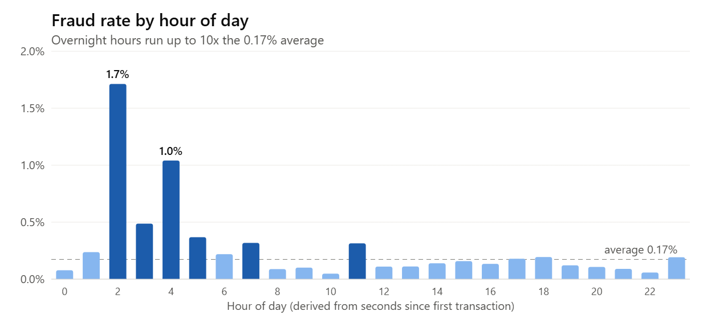

# Credit Card Fraud Detection

Flagging fraudulent card transactions so an operations team can act quickly — while keeping false alerts low enough to be workable.

**Tools:** SQL (DuckDB) · Python (pandas, scikit-learn, XGBoost) · matplotlib / seaborn

## Business problem
Fraud is rare but expensive. A model that alerts on everything wastes analyst time; a model that alerts on nothing lets chargebacks through. The question is: **which transactions should be sent for review, and what does that save?**

## Data
284,807 card transactions over two days ([ULB / Kaggle public dataset](https://www.kaggle.com/datasets/mlg-ulb/creditcardfraud)). 492 are fraud (**0.17%**). Features `V1–V28` are anonymized PCA components; `Time`, `Amount` and `Class` are raw. See [`data/README.md`](data/README.md) to download.

## Approach
1. **SQL exploration** ([`sql/fraud_eda.sql`](sql/fraud_eda.sql)) — fraud rate by hour and by amount band.
2. **Time-based split** — train on the first 80% of transactions, test on the last 20%, so the model is always judged on *future* data (like production).
3. **Models** — logistic regression baseline vs. XGBoost, both weighted for class imbalance.
4. **Threshold by cost** — each alert costs $5 of review time; each missed fraud costs its full amount. Pick the threshold with the lowest total cost.

Full analysis: [`notebooks/fraud_detection.ipynb`](notebooks/fraud_detection.ipynb)

## Key findings
| | Result (test period: 56,962 transactions, 75 frauds) |
|---|---|
| Model quality | XGBoost PR-AUC **0.79** vs. **0.76** for the baseline |
| Alerts generated | **65** (0.11% of transactions) |
| Precision | **88%** of alerts were real fraud |
| Recall | **76%** of fraud cases caught |
| Fraud dollars caught | **$5,091 of $7,729 (66%)** |
| Total cost (missed fraud + reviews) | **$2,963 vs. $7,729 with no model — 62% lower** |

- **Overnight risk:** in the first ~5 hours of each day in the data, the fraud rate reaches **1.7%** — about **10× the average** — while legitimate volume is at its lowest. (Hours are derived from seconds elapsed since the first transaction.)
- **Small-ticket fraud:** the median fraudulent transaction is **$9.25** vs. **$22** for legitimate ones — consistent with card-testing behaviour.



## Recommendations
- Send model alerts above the cost-optimal threshold to a review queue; tighten rules overnight.
- Add customer-level features (transaction velocity, new merchant/device) to lift recall further.
- Monitor precision, recall and score drift weekly; recalibrate monthly.

## Run it
```bash
pip install -r requirements.txt
python scripts/download_data.py
jupyter notebook notebooks/fraud_detection.ipynb
```

---
*Built by Shanmukha Sai Reddy Bhimireddy — Data / Business Analyst. Public data only.*
